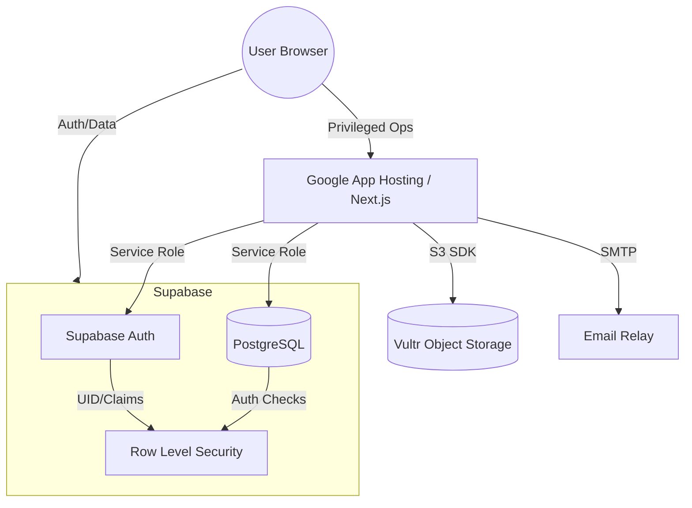

# Store2Door Migration Audit: Firebase to Supabase (REVISED)

This document provides a hardened, relational architecture for migrating the FromStore2Door logistics platform from Firebase to Supabase/PostgreSQL.

## 1. Security Architecture (RBAC)

Ordinary users must NEVER be able to escalate their privileges. Profile data (Name, Phone) is separated from Authorization data (Roles).

### 1.1 Secure Role Registry
Instead of a boolean on the profile, we use a dedicated schema:
- **`app_roles` (Table)**: 
  - `id`: uuid (PK, references auth.users)
  - `role`: enum ('customer', 'staff', 'admin')
- **Protection**: This table is excluded from ordinary `INSERT/UPDATE` policies. Only the `service_role` (Server-side) can modify it.

### 1.2 Authorization Functions
```sql
-- Secure function to check admin status within RLS
CREATE OR REPLACE FUNCTION is_admin() 
RETURNS boolean AS $$
  SELECT EXISTS (
    SELECT 1 FROM app_roles 
    WHERE user_id = auth.uid() AND role = 'admin'
  );
$$ LANGUAGE sql SECURITY DEFINER;
```

---

## 2. Financial Ledger Architecture

Balances must be auditable. A `wallet_balance` field is prone to race conditions and manual tampering.

### 2.1 The Unified Ledger (`financial_ledger`)
- `id`: uuid (PK)
- `user_id`: uuid (references profiles.id)
- `amount`: numeric(12,2) -- Signed value (positive for credit, negative for debit)
- `type`: enum ('payment', 'refund', 'adjustment', 'shipping_fee')
- `reference_id`: uuid (nullable, links to shipments or invoices)
- `created_at`: timestamptz (default now())

### 2.2 Atomic Balance Updates
Balances are derived by summing the ledger or updated via **Database Triggers** that react to ledger entries. This ensures the balance always matches the sum of transactions.

---

## 3. Normalized Relational Schema

### 3.1 Profiles & Logistics
- **`profiles`**: Basic identity (full_name, phone, trn, mailbox_number).
- **`addresses`**: 1:N relationship. Handles multiple delivery targets in Jamaica.
- **`manifests`**: Flight/Voyage grouping for shipments.

### 3.2 Shipment Lifecycle
- **`shipments`**: Master record (tracking_number, weight, current_status, manifest_id).
- **`shipment_tracking_events`**: Detailed history (timestamp, status, location, description).
- **`invoices`**: Billing records linked to shipments.

---

## 4. Migration Strategy (The "Truth-Shift" Model)

To avoid data corruption during the transition, we define a clear "Source of Truth" for each phase.

### 4.1 Phase 1: Identity Import
- **Firebase Export**: Export users using `firebase auth:export`.
- **Supabase Import**: Use the Supabase Auth migration tool. 
- **CRITICAL**: Requires Firebase `hash_config` (algorithm, base64_signer_key, salt_separator, rounds) to import passwords without reset.

### 4.2 Phase 2: Background Mirroring (Shadow Write)
- Keep Firebase as the **Source of Truth**.
- Update Next.js API routes to write to Firebase first, then *asynchronously* push to Supabase.
- Log failures to a `migration_logs` table for manual reconciliation.

### 4.3 Phase 3: The Verification Lock
- Stop all writes for a 1-hour maintenance window.
- Run a final reconciliation script to ensure Supabase matches Firestore exactly.
- Switch "Source of Truth" to Supabase.

---

## 5. Implementation Requirements

### 5.1 Real-time Requirements
- **Customer Tracking**: Direct Supabase Realtime subscription on `shipment_tracking_events`.
- **Admin Dashboard**: Realtime subscription on `shipments` status changes.

### 5.2 Storage Stability
- **Vultr Primary**: We will **NOT** migrate to Supabase Storage. The current Vultr integration via S3-SDK is high-performance and avoids unnecessary vendor lock-in.

### 5.3 Hosting Configuration
- Store2Door remains on **Google App Hosting**.
- **Public Secrets (Browser)**: `NEXT_PUBLIC_SUPABASE_URL`, `NEXT_PUBLIC_SUPABASE_ANON_KEY`.
- **Private Secrets (Server)**: `SUPABASE_SERVICE_ROLE_KEY` (for Admin ops), `VULTR_SECRET`.

---

## 6. Target Architecture Diagram



**Audit Complete.** This plan provides a hardened path for Store2Door's next-generation infrastructure.